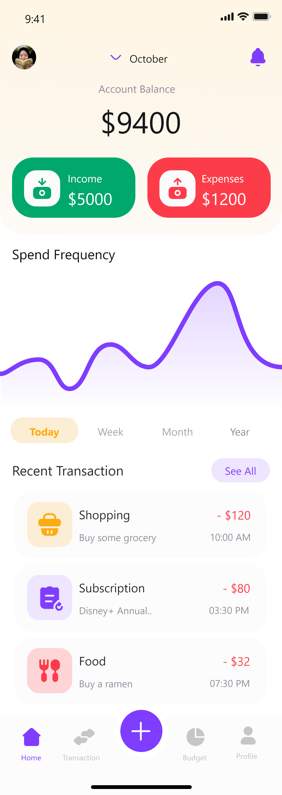
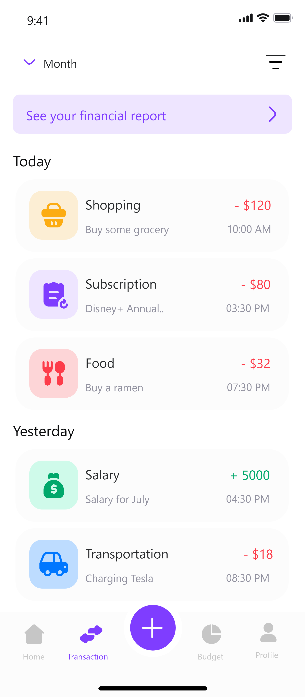

# ExpenseTracker

Ứng dụng quản lý chi tiêu

## 1. Mục đích ứng dụng

Ứng dụng được tạo ra với ra với nhu cầu của bản thân

- Ghi nhận lại những chi tiêu trong ngày.
- Đặt ra giới hạn chi tiêu cho mỗi hạng mục, mục đích chi tiêu.
- Thống kê chi tiêu trong tháng để có điều chỉnh phủ hợp.

## 2. Sitemap

## 3. Các chức năng của ứng dụng

  
Đăng nhập - Tạo tài khoản

  |  |  |
| :---------------------------: | :------------------------------------: |
|     _Màn hình đăng nhập - tạo tài khoản_      |        _Màn hình nhập mã xác nhận_        |

  
Cài đặt tài khoản

  |  |  |
| :---------------------------: | :------------------------------------: |
|     _Màn hình cài đặt mã pin_      |        _Màn hình tạo mới các tài khoản chi tiêu_        |

  
Xem lịch sử chi tiêu và biểu đồ cơ bản

  
  |  |  |
| :---------------------------: | :------------------------------------: |
|     _Màn hình Home_      |        _Màn hình Transaction_        |

  
Chi tiết chi tiêu

  |    |
| :-------------------------------------: |
|  _Màn hình tạo mới chi tiêu_            |

|    |
| :-------------------------------------: |
|  _Màn hình tạo mới thu nhập_            |

|    |
| :-------------------------------------: |
|  _Màn hình chi tiết chi tiêu_            |

  
Đặt ngân sách chi tiêu

  |  |  |
| :---------------------------: | :------------------------------------: |
|     _Màn hình ngân sách cho từng tháng_      |        _Màn hình chi tiết của ngân sách_        |

  
Thông kê thu nhập - chi tiêu

  |  |
| :---------------------------: |
|     _Màn hình thống kê_      |

## 4. Công nghệ sử dụng

- Flutter
- Firebase (Firestore, Cloud Storage)
